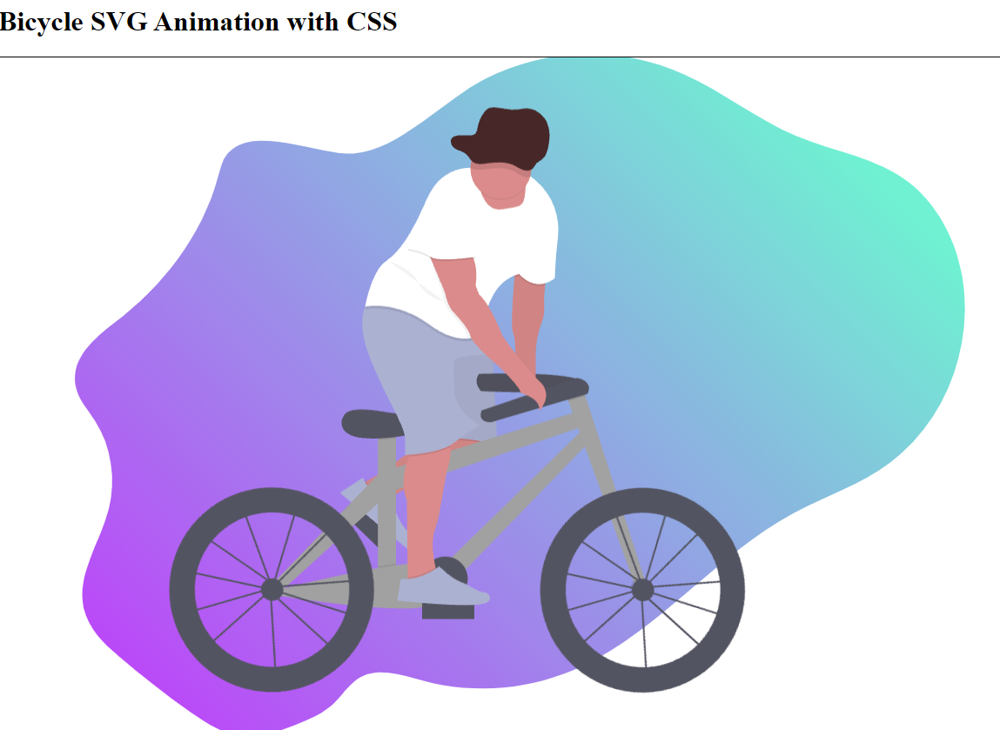
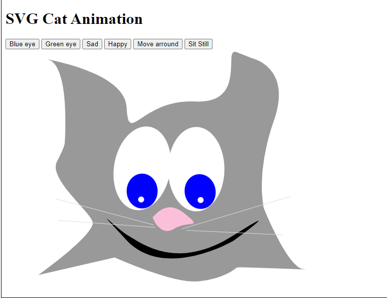
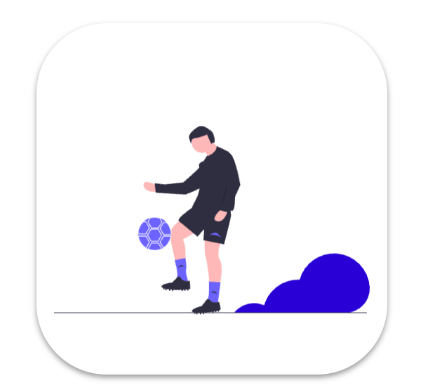
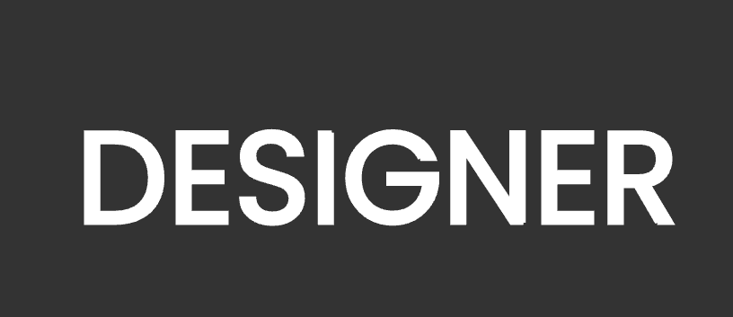

# CSS GRID Practice

## Click the bellow link to see some of my project

---

## What i learned?

### SVG attribute

---

> stroke-dasharray: none[default] | dasharray | 10, 5 | 18, 10, 6

-   `stroke-dasharray: 10`
-   `stroke-dasharray: 10 10`
-   `stroke-dasharray: 10 5`

> stroke-dashoffset: 0[default] | length | 5 | 10;

-   `stroke-dashoffset: 5`
-   `stroke-dashoffset: 15`

> stroke-width: length | percentage | 5px ;

-   `stroke-width: 5px`

> fill: color | red;

-   `fill: green`

### CSS transform propertie

---

> transform: translateX | translateY | rotate | rotateY | scale | scaleX | scaleY;

-   `transform: translate(100px, 100px);`
-   `transform: rotate(25deg);`
-   `transform: scale(1.5);`

> transform-origin: x-offset y-offset |center center [default] | top left | top right | bottom left | bottom right | ;

-   `transform-origin: center center;`
-   `transform-origin: left 50px;`
-   `transform-origin: 0 0;`

> transform-box: fill-box | view-box[default];

-   `transform-box: fill-box;`

### CSS animation propertie & @keyframe

---

> animation-name: none[default] | the animation’s name;

-   `animation-name: bounce;`

> animation-duration: 0[default] | 0.5s(half a second) | 1s

-   `animation-duration: 1s;`

> animation-timing-function: ease[default] | linear | ease-in | ease-out | ease-in-out

> > **Ease:** slow start, fast middle, slow end

> > **Linear:** constant speed

> > **Ease In:** slow start, fast end

> > **Ease Out:** fast start, slow end

> > **Ease In Out:** like ease, but with more pronounced acceleration/deceleration curves

-   `animation-timing-function: linear;`

> animation-delay: 0s[default] | 1s | 2s

-   `animation-delay: 1s;`

> animation-iteration-count: 1[default] | 2 | infinite

> > integers like 2 or 3

> > non-integers like 0.5 which will play only half the animation

> > the keyword infinite which will repeat the animation indefinitely

-   `animation-iteration-count: 2;`

> animation-fill-mode: none[default] | forwards | backwards | both

> > **None:** the animation styles do not affect the default style

> > **Forwards:** the last styles applied at the end of the animation are retained afterwards

> > **Backwards:** the animation's styles will already be applied before the animation actually starts

> > **Both:** the styles are applied before and after the animation plays

Already blueFrom blue to greenRemains gree

-   `animation-fill-mode: forward;`

> animation-direction: normal[default] | reverse | alternate | alternate-reverse

> > **normal**: starts at 0%, ends at 100%, starts at 0% again

> > **reverse**: starts at 100%, ends at 0%, starts at 100% again

> > **alternate**: starts at 0%, goes to 100%, goes to 0%

> > **alternate-reverse**: starts at 100%, goes to 0%, goes to 100%

-   `animation-direction: forward;`

---

**Bicycle SVG Animation with CSS**

-   

**Cat SVG Animation with CSS**

-   

**Soccer SVG Animation with CSS**

-   

**Text SVG Animation with CSS**

-   

References:

1. https://marksheet.io/css-animations.html
2. https://www.w3schools.com/css/css3_animations.asp
3. https://www.youtube.com/watch?v=IM8eTD01UE8
4. https://www.youtube.com/watch?v=gWai7fYp9PY&t=2s
5. https://www.youtube.com/watch?v=vJNVramny9k
